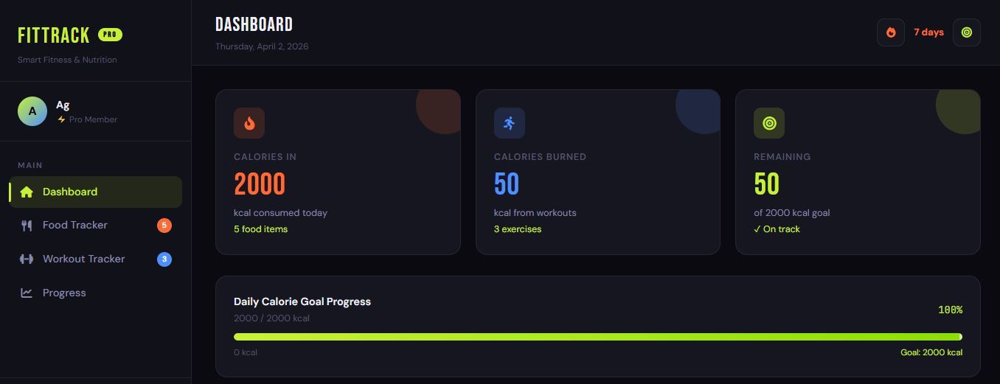
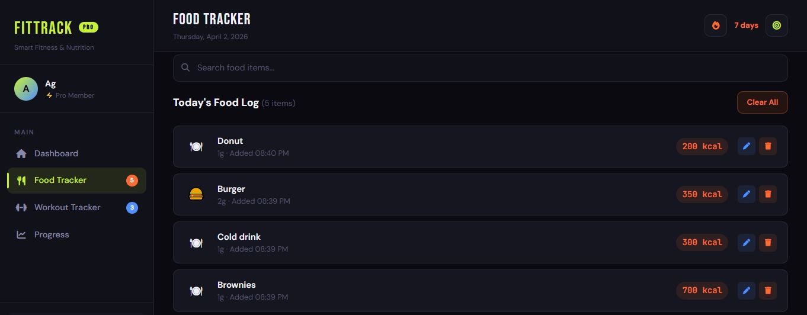
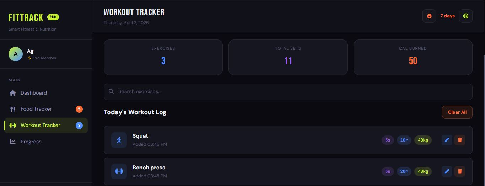
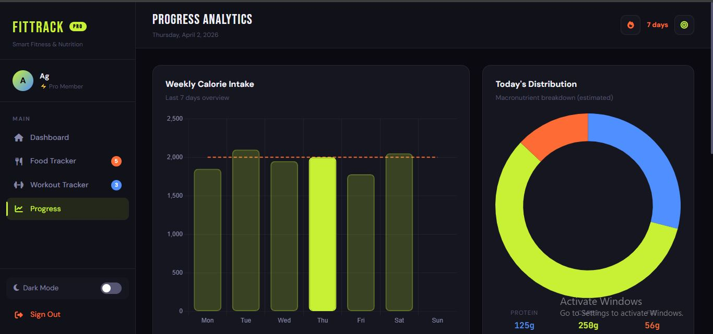

# Web-Technologies-Lab-7
# FitTrack Pro — Smart Fitness & Nutrition Tracker 🏋️‍♂️🍎
FitTrack Pro is a comprehensive personal health dashboard designed to help users monitor their daily caloric intake, track workouts, and visualize their fitness progress. This project combines a sleek, modern "Dark Mode" aesthetic with functional data management.
# 🚀 Features
Personalized Dashboard: Real-time calculation of "Calories In" vs. "Calories Out" with a visual goal progress bar.
Food Tracker: Log meals with calorie and quantity details. Includes a built-in emoji mapper for food items.
Workout Logger: Track exercises, sets, reps, and weights. Automatically calculates calories burned based on volume.
Progress Analytics: (Integrated with Chart.js) Visualizes weekly calorie trends and macronutrient distribution (Protein/Carbs/Fats).
Water Tracker: Interactive counter to monitor daily hydration goals.
Responsive Design: Fully optimized for both desktop and mobile viewing using a custom CSS Grid and Flexbox architecture.
Persistence: Uses localStorage to save your data, so your logs remain even after refreshing the browser.
# 🛠️ Tech Stack
Frontend Framework: AngularJS (v1.8)
Styling: Custom CSS3 (with CSS Variables), Bootstrap 5
Icons & Fonts: Font Awesome 6, Google Fonts (Bebas Neue, DM Sans, JetBrains Mono)
Data Visualization: Chart.js
Language: JavaScript / TypeScript (Transitioning to Component-based architecture)
📸 Screenshots

# ⚙️ Installation & Usage
Clone the repository:
git clone [https://github.com/YourUsername/fittrack-pro.git](https://github.com/YourUsername/fittrack-pro.git)
Open the project: Simply open the index.html file in any modern web browser.
Demo Mode: Use the "Demo Login" button on the landing page to populate the app with sample data instantly.
# 🧑‍💻 Author
Abdul Ghani BS-IT Student. Department Of Computing and Artificial Intelligence.
Developed as part of a Web Development semester project focused on state management and responsive UI/UX.

